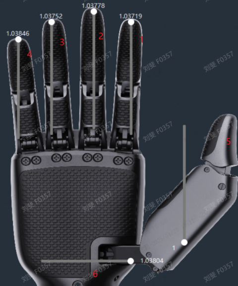
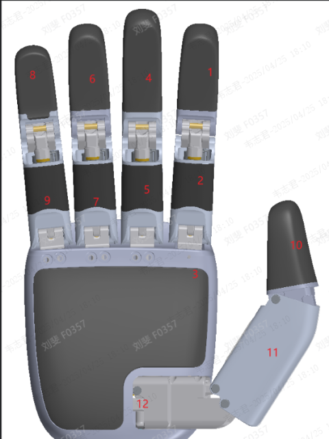
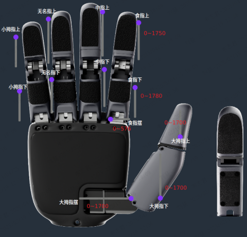

# DexHand SDK 接口文档

## 简介

DexHand SDK 提供了一套与底层灵巧手设备通信的接口，通过 UDP 协议实现控制和数据交互。设备以 IP 地址作为唯一标识。

默认左手IP `<192.168.137.19>`  
默认右手IP `<192.168.137.39>`

当前仅支持在linux系统中使用。

## 版本更新记录

|  版本号  |  日期  |  作者  |  更新内容  |  备注  |
| --- | --- | --- | --- | --- |
|  0.0.1  |  2025-04-25  |   |  初版  |   |
| 0.0.2 | 2026-01-29 |      | 补充控制模式说明并新增推荐 Python 版本 |      |

## 接口描述

所有 DexHand 相关接口均封装在 FdHand 命名空间下（C++）。

### Ret 枚举类

定义了返回值枚举类 Ret，用于表示接口操作结果。

```c++
enum class Ret
{
    SUCCESS = 0,
    FAIL = -1,
    TIMEOUT = -2
};
```

### DexHand 接口类

#### init

初始化 DexHand 灵巧手设备，扫描已连接所有设备。

```c++
Ret init(int flg = 0);
```

##### 参数

`flg` (int, 默认 0): 初始化标志，保留扩展。

##### 返回值

`Ret::SUCCESS`: 成功  
`Ret::FAIL`: 失败  
`Ret::TIMEOUT`: 超时  

#### get\_ip\_list

获取已连接设备的 IP 地址列表。一个IP地址对应一个灵巧手。

```c++
std::vector<std::string> get_ip_list();
```

##### 返回值

已连接设备的 IP 地址列表（字符串列表）。

#### get\_name

获取设备名称。

```c++
// 设备名称：
// Inspire：   “FSH”
// DexHand-FDH6： “fdhv1”
// DexHand-FDH12： “fdhv2”
std::string get_name(std::string ip);
```

##### 参数

`ip` (std::string): 目标设备 IP。

##### 返回值

设备名称（字符串）。

#### get\_type

获取设备类型。

```c++
// 设备类型
// Inspire： “Hand”
// FDH6：    “FDH-6L”，“FDH-6R”
// FDH12：   “FDH-12L”，“FDH-12R”
std::string get_type(std::string ip);
```

##### 参数

`ip` (std::string): 目标设备 IP。

##### 返回值

设备类型（字符串）。

#### get\_driver\_ver

获取驱动固件版本号

```c++
std::string get_driver_ver(std::string ip);
```

##### 参数

`ip` (std::string): 目标设备 IP。

##### 返回值

驱动版本号（字符串，格式：0.0.0.0）。

#### get\_hardware\_ver

获取机械PCB版本号

```c++
std::string get_hardware_ver(std::string ip);
```

##### 参数

`ip` (std::string): 目标设备 IP。

##### 返回值

硬件版本号（字符串，格式：0.0.0.0）。

#### set\_pos

设置目标设备位置。6/12自由度长度列表。某个位置不控制写-1

6自由度对应位置和范围如下所示:  
食指1：0-1  
中指2：0-1  
无名指3：0-1  
小指4：0-1  
拇指5-6: 0-1  



12自由度对应位置和范围如下图所示：  
食指1-3：0-1750，0-1780，0-576  
中指4-5：0-1750，0-1780  
无名指6-7：0-1750， 0-1780  
小指8-9：0-1750， 0-1780  
拇指10-12：0-1700，0-1700，0-1700  





```c++
Ret set_pos(std::string ip, std::vector<float> pos);
```

##### 参数

`ip` (std::string): 目标设备 IP 地址。  
`pos` (std::vector<float>): 目标位置（浮点数列表）。  
6 自由度：每个自由度范围为 [0-1]。  
食指 1、中指 2、无名指 3、小指 4、拇指 5-6。  
12 自由度：详见接口文档中的自由度定义。  

##### 返回值

`Ret::SUCCESS`: 成功  
`Ret::FAIL`: 失败  

#### get\_pos

获取目标设备当前位置。

```c++
std::vector<float> get_pos(std::string ip);
```

##### 参数

`ip` (std::string): 目标设备 IP。

##### 返回值

当前位置（浮点数列表），通信失败返回空列表。


#### reboot

重启设备。

```c++
Ret reboot();
Ret reboot(std::string ip);
```

##### 参数

`ip` (std::string, 可选): 目标设备 IP，不指定时重启所有设备。

##### 返回值

`Ret::SUCCESS`: 成功  
`Ret::FAIL`: 失败  

#### get_ts_matrix

获取触摸传感器数据。

```c++
std::vector<std::vector<uint8_t>> get_ts_matrix(std::string ip);
```

##### 参数

`ip` (std::string): 目标设备 IP。

##### 返回值

6*96字节数据列表，失败返回空列表。

#### get_pvc

获取位置弧度，速度，电流。

```c++
std::vector<std::vector<float>> get_pvc(std::string ip);
```

##### 参数

`ip` (std::string): 目标设备 IP。

##### 返回值

返回位置，速度，电流数组，失败返回空列表。

#### set_pvc

设置位置弧度，速度，电流  
FDH12默认模式位置弧度控制，p参数弧度，PD控制模式pvc参数弧度/速度前馈/电流前馈  
FDH12关节弧度范围：  
食指1-3：0.2～1.69, 0.01～1.43, -0.04～0.26  
中指4-5：0.2～1.69, 0.01～1.43  
无名指6-7：0.2～1.69, 0.01～1.43  
小指8-9：0.2～1.69, 0.01～1.43  
拇指10-12：-0.02～1.23, 0.14～1.35, 0.2～1.57  

FDH6默认弧度速度控制模式，pv参数弧度/速度  
FDH6关节弧度范围：  
食指1：0.17～1.78  
中指2：0.17～1.78  
无名指3：0.17～1.78  
小指4：0.17～1.78  
拇指5-6：0.12-1.28, 0.0-1.68  

```c++
Ret set_pvc(std::string ip, std::vector<std::vector<float>> pvc);
```

##### 参数

`ip` (std::string): 目标设备 IP。
`pvc` (std::vector<std::vector<float>>): 位置，速度，电流数组

##### 返回值

`Ret::SUCCESS`: 成功  
`Ret::FAIL`: 失败  

#### set_pd_params

设置pd参数

```c++
Ret set_pd_params(std::string ip, std::vector<std::vector<float>> params);
```

##### 参数

`ip` (std::string): 目标设备 IP。
`params` (std::vector<std::vector<float>>): PD控制参数，二维数组

##### 返回值

`Ret::SUCCESS`: 成功  
`Ret::FAIL`: 失败  

#### set_ctrl_mode

设置控制模式

```c++
Ret set_ctrl_mode(std::string ip, CtrlType mode);
```

| 模式             | 设定值                 | 说明                                                                                                                                                                        |
| ---------------- | ---------------------- | --------------------------------------------------------------------------------------------------------------------------------------------------------------------------- |
| 位置模式（默认） | `pos_des` 任意有效角度 | 位置闭环，**速度**与**电流**仅做限制<br>不限制请填 `-1`（内部会替换默认值）。请不要使用过大的电流值，会造成手的严重损伤！！                                                 |
| PD 位置模式      | `ctrl_mode = PD_POS`   | 输出 torque =`Kp·pos_err + Kd·vel_err + feedforward`<br>其中 `pos_err = pos_des - pos_fbk`（rad）<br>`vel_err = vel_des - vel_fbk`（rad/s）<br>`feedforward` 由用户输入。 |

##### 参数

`ip` (std::string): 目标设备 IP。
`mode` 控制模式

##### 返回值

`Ret::SUCCESS`: 成功  
`Ret::FAIL`: 失败  

#### get_ctrl_mode

获取控制模式

```c++
CtrlType get_ctrl_mode(std::string ip);
```

##### 参数

`ip` (std::string): 目标设备 IP。

##### 返回值

`CtrlType`: 当前模式  

#### get_hand_config

获取设备配置。

```c++
HandCfg_t get_hand_config(std::string ip);
```

##### 参数

`ip` (std::string): 目标设备 IP。

##### 返回值

`HandCfg_t`: 当前配置

#### set_hand_config

写入配置

```c++
Ret set_hand_config(std::string ip, HandCfg_t config);
```

##### 参数

`ip` (std::string): 目标设备 IP。
`config` 配置。

##### 返回值

`Ret::SUCCESS`: 成功  
`Ret::FAIL`: 失败  

#### get_errorcode

获取错误码

```c++
std::vector<long> get_errorcode(std::string ip);
```

##### 参数

`ip` (std::string): 目标设备 IP。

##### 返回值

错误码列表

#### set_controller_config

设置控制参数

```c++
Ret set_controller_config(std::string ip, CtrlCfg_t config);
```

##### 参数

`ip` (std::string): 目标设备 IP。

##### 返回值

`Ret::SUCCESS`: 成功  
`Ret::FAIL`: 失败  

#### get_controller_config

设置控制参数

```c++
CtrlCfg_t get_controller_config(std::string ip);
```

##### 参数

`ip` (std::string): 目标设备 IP。

##### 返回值

`CtrlCfg_t`：控制参数  

### HandType 枚举类

```c++
enum class HandType {
    FDH_X = 0,
    FDH_L = 1,
    FDH_R = 2
};
```

### CtrlType 枚举类

```c++
enum class CtrlType {
    NONE,
    POS_LOOP = 2,
    PD_LOOP,
    POS_VEL_CUR_LOOP,
};
```

### HandCfg_t 配置类

```c++
class HandCfg_t
{
public:
    int result = 0;
    HandType type = HandType::FDH_X;
    std::string sn;
    std::array<uint8_t, 6> mac;
    std::string ip;
    std::string gateway;
    bool enWriteIntoChip = true;
}
```

### CtrlCfg_t 控制配置类

```c++
class CtrlCfg_t
{
public:
    uint8_t result = 0;
    std::array<float, 12> PDKp;
    std::array<float, 12> PDKd;
    std::array<float, 12> PosKp;
    std::array<float, 12> PosKi;
    std::array<float, 12> PosKd;
    bool enWriteIntoChip = false;
};
```

## 接口支持列表

|  interface  |  inspire  |  fdh6  |  fdh12  |
| --- | --- | --- | --- |
|  init  |  √  |  √  |  √  |
|  get_ip_list  |  √  |  √  |  √  |
|  get_name  |  √  |  √  |  √  |
|  get_type  |  √  |  √  |  √  |
|  get_driver_ver  |  √  |  √  |  √  |
|  get_hardware_ver  |  √  |  √  |  √  |
|  set_pos  |  √  |  √  |  √  |
|  get_pos  |  √  |  √  |  √  |
|  reboot()  |   |  √  |  √ |
|  reboot(ip)  |   |  √  |  √ |
|  get_ts_matrix  |   |    |  √  |
|  get_pvc  |   |  √   |  √  |
|  set_pvc  |   |   √  |  √  |
|  set_pd_params  |   |     |  √  |
|  set_ctrl_mode  |   |      |  √  |
|  get_ctrl_mode  |   |      |  √  |
|  get_hand_config  |   |  √   |  √  |
|  set_hand_config  |   |    √  |    √ |
|  get_errorcode  |   |    √  |    √ |
|  get_controller_config  |   |    |    √ |
|  set_controller_config  |   |    |    √ |
